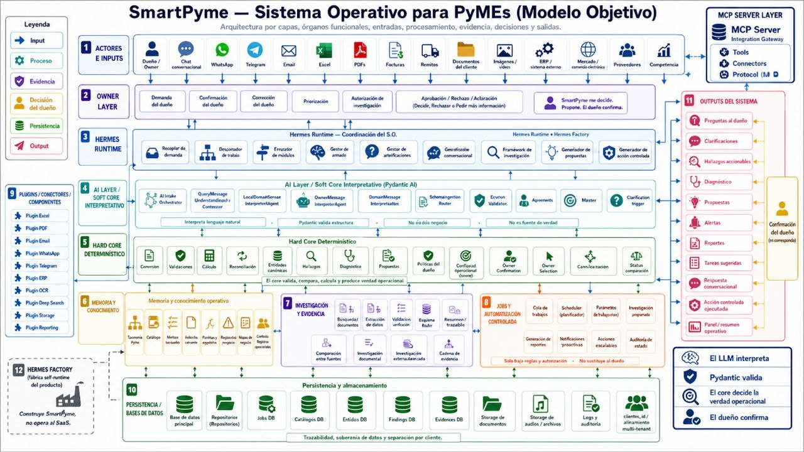

# SmartPyme — Sistema Operativo para PyMEs (Modelo Objetivo)

**Estado:** Artefacto rector / Maqueta objetivo (Versión con MCP Server Layer)
**Propósito:** Mapa de referencia para capas, órganos funcionales, entradas, procesamiento, evidencia, decisiones y salidas.

## Reglas Centrales
- El LLM interpreta.
- Pydantic valida.
- El core decide la verdad operacional.
- El dueño confirma.
- SmartPyme no decide: propone.

## Arquitectura de Integración (MCP)
Esta versión del modelo incorpora explícitamente la **MCP Server Layer** como el estándar de comunicación entre el sistema y el mundo exterior (Hermes Gateway, interfaces de usuario y conectores de terceros).

### Componentes Clave:
- **MCP Server Layer:** Expone el catálogo de herramientas (Tools) para ser consumidas por el operador conversacional.
- **Tools:** Funciones atómicas y seguras (ej: `create_job`, `resolve_clarification`, `ingest_document`).
- **Connectors:** Adaptadores de entrada para fuentes de datos (Excel, PDF, ERP).
- **Protocol (Model Context Protocol):** Garantiza que SmartPyme sea un sistema soberano e interoperable.
- **Relación con Outputs:** Conecta los hallazgos y propuestas del sistema con el canal de salida del dueño.

## Separación de Entornos
- **Hermes Runtime:** El producto en ejecución para el cliente final PyME.
- **Hermes Factory:** La infraestructura de construcción, tests y auditoría de la factoría.

## Mapa Objetivo

*Nota: Este mapa guía la evolución estratégica del producto; no implica que todos los nodos o conectores estén implementados en la rama actual.*
