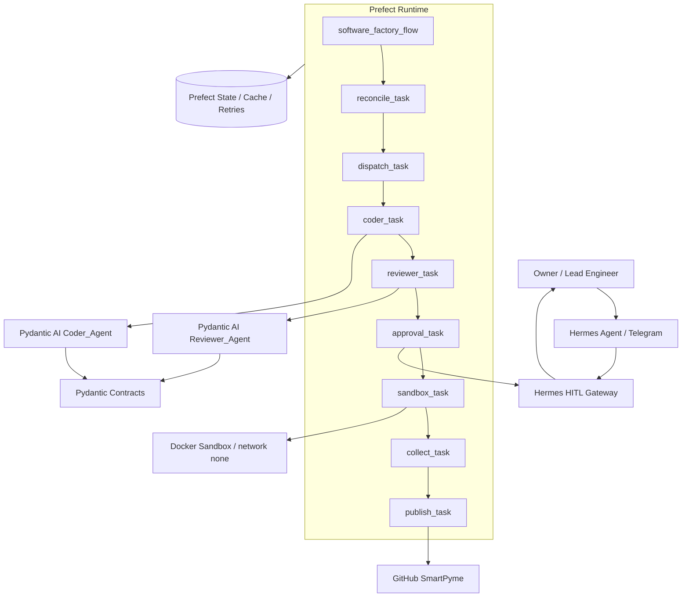

# Blueprint técnico v2 — Factoría SmartPyme con Prefect + Pydantic AI + Hermes

## Estado

```text
CANONICAL_DRAFT
HITO_001_PREFECT_SCAFFOLD: PASS_FUNCIONAL
```

Este documento congela la arquitectura base de la factoría SmartPyme después de validar el primer scaffold Prefect en la VM.

---

# 1. Decisión arquitectónica

La factoría se construye con separación estricta de responsabilidades:

```text
Prefect = runtime durable del workflow
Pydantic / Pydantic AI = contratos + agentes tipados
Hermes = HITL, Telegram, aprobación humana y fail-closed gateway
Docker = sandbox obligatorio para ejecución de código generado
GitHub = fuente de verdad del código
GCP VM = infraestructura persistente
MAF / Magentic-One = referencia conceptual, no runtime principal
```

Microsoft Agent Framework y Magentic-One se conservan solo como fuente conceptual para:

```text
Task Ledger
Progress Ledger
Reconcile → Dispatch → Collect
orquestación multiagente por roles
```

El runtime durable oficial experimental pasa a ser Prefect.

---

# 2. Principios no negociables

```text
1. El workflow no vive en prompts largos.
2. El workflow vive en Prefect, contratos y estado.
3. Pydantic valida toda frontera de datos.
4. Pydantic AI solo produce outputs tipados.
5. Hermes aprueba o bloquea acciones peligrosas.
6. Docker ejecuta código generado en sandbox.
7. GitHub confirma cierre real.
8. La VM ejecuta, pero no es fuente final de verdad.
```

---

# 3. Diagrama de arquitectura



---

# 4. Modelo operativo

## 4.1 Reconcile

Detecta tareas bloqueadas, intentos fallidos, comandos peligrosos, outputs inválidos, necesidad de aprobación humana, cache reutilizable, timeout o retry.

## 4.2 Dispatch

Asigna una unidad de trabajo a Planner_Agent, Coder_Agent, Reviewer_Agent, Hermes_Gateway, SandboxRunner o Publisher.

## 4.3 Collect

Recolecta diff propuesto, review decision, sandbox result, approval result, test report y git result. Actualiza TaskLedger, ProgressLedger, evidencia y estado Prefect.

---

# 5. Estructura canónica experimental

```text
experiments/prefect-factory/
  README.md
  config.yaml
  requirements.txt
  Dockerfile.sandbox
  docker-compose.yml

  factory_prefect/
    contracts/
      messages.py
      ledgers.py
      hitl.py
      sandbox.py
      git.py

    agents/
      planner_agent.py
      coder_agent.py
      reviewer_agent.py
      auditor_agent.py

    flows/
      software_factory_flow.py

    tasks/
      reconcile.py
      dispatch.py
      collect.py
      approval.py
      sandbox.py
      publish.py

    hermes/
      approval_client.py
      telegram_gateway_contract.py

    sandbox/
      command_policy.py
      docker_runner.py

    tests/
      test_contracts.py
      test_command_policy.py
      test_flow_smoke.py
```

---

# 6. Contratos obligatorios

```text
CodePatchProposal
ReviewDecision
SandboxExecutionRequest
SandboxExecutionResult
HumanApprovalRequest
HumanApprovalResult
TaskLedger
ProgressLedger
FactoryEvent
```

Reglas:

```text
- CodePatchProposal debe incluir al menos un archivo a crear o modificar.
- ReviewDecision debe devolver HUMAN_REQUIRED si detecta comandos peligrosos.
- HumanApprovalResult debe fallar cerrado si Hermes no responde.
- SandboxExecutionResult debe registrar stdout, stderr, returncode y bloqueo.
```

---

# 7. Seguridad

Hermes debe aprobar antes de:

```text
- provisioning GCP;
- terraform apply;
- comandos gcloud;
- rm / chmod / chown;
- curl / wget;
- docker run de código generado;
- git push;
- ejecución de código generado en sandbox productivo;
- fallos Pydantic que requieran decisión humana.
```

Regla fail-closed:

```text
Sin aprobación explícita, no ejecutar.
```

---

# 8. Sandbox

Docker es obligatorio para código generado.

Defaults requeridos:

```text
network: none
read_only_root: true
memory limit
cpu limit
timeout
no privileged mode
```

---

# 9. Cierre real de hito

Un hito no queda DONE por texto del agente.

DONE real exige:

```text
tests pass
+ worktree limpio
+ commit
+ push
+ remote sync OK
+ evidencia suficiente
```

---

# 10. Estado validado de HITO_001

En VM se validó el scaffold base Prefect:

```text
Flow: software_factory_flow
Run: dazzling-wombat
reconcile_task: Completed
dispatch_task: Completed
reviewer_task: Completed
collect_task: Completed
TASK_001_PREFECT_SCAFFOLD_SMOKE: DONE
```

Resultado:

```text
HITO_001_PREFECT_SCAFFOLD: PASS_FUNCIONAL
```

Pendiente externo observado:

```text
M experiments/ms-agent-framework/graph_workflow.py
```

Ese cambio corresponde al experimento MAF anterior y debe limpiarse antes de declarar worktree limpio.

---

# 11. Próximos hitos

```text
HITO_002_HERMES_FAIL_CLOSED
Crear HumanApprovalRequest / HumanApprovalResult y HermesApprovalClient fail-closed.

HITO_003_SANDBOX_POLICY
Crear command_policy.py y Docker sandbox policy con tests.

HITO_004_PYDANTIC_AI_AGENTS
Conectar Coder_Agent y Reviewer_Agent con output_type real.
```

---

# 12. Frase rectora

```text
Prefect gobierna el proceso.
Pydantic gobierna los datos.
Hermes gobierna la autorización humana.
Docker gobierna la ejecución.
GitHub gobierna la realidad final.
```
