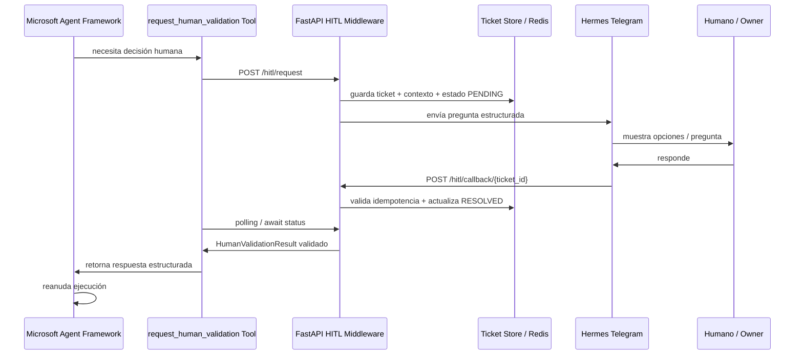

# HITL Suspend & Resume Architecture — Microsoft Agent Framework + Hermes

## Estado

Documento de arquitectura experimental.

Ruta:

```text
experiments/ms-agent-framework/HITL_SUSPEND_RESUME_ARCHITECTURE.md
```

Este documento fija el patrón correcto para integrar Microsoft Agent Framework con Hermes Agent sin destruir tokens ni mezclar responsabilidades.

---

# 1. Principio central

La integración entre un motor agéntico y un humano no debe ser una ejecución lineal larga.

Debe ser:

```text
Event-Driven Suspend & Resume
```

Es decir:

```text
workflow ejecuta
→ necesita decisión humana
→ crea ticket HITL
→ suspende ese hilo de trabajo
→ Hermes pregunta al humano
→ humano responde
→ callback valida respuesta
→ workflow reanuda
```

Regla:

```text
El agente no conversa directamente con el humano.
El agente invoca una tool de validación humana.
```

---

# 2. Topología del sistema

```text
Microsoft Agent Framework
  Motor de workflow/agentes
  Ejecuta pasos, tools y nodos

FastAPI + DB/Redis
  Middleware de estado
  Crea tickets, guarda contexto, expone callbacks, valida idempotencia

Hermes Agent / Telegram
  Interfaz Human-in-the-Loop
  Pregunta al humano, captura respuesta y la devuelve al middleware

Pydantic
  Contratos estrictos de request, callback y result
```

---

# 3. Diagrama lógico



---

# 4. Responsabilidades por capa

## 4.1 Microsoft Agent Framework

Responsabilidad:

```text
- ejecutar el workflow;
- invocar tools;
- suspender/reanudar tareas;
- consumir respuestas estructuradas;
- no saber que Telegram existe.
```

No debe:

```text
- hablar directo con Hermes;
- parsear lenguaje humano caótico;
- manejar permisos de Telegram;
- guardar tickets HITL por su cuenta.
```

## 4.2 Tool `request_human_validation`

Responsabilidad:

```text
- crear solicitud HITL;
- esperar resolución asíncrona;
- devolver un resultado Pydantic al workflow.
```

No debe:

```text
- decidir por el humano;
- ejecutar acciones de negocio;
- modificar SmartPyme core;
- escribir en Git.
```

## 4.3 FastAPI HITL Middleware

Responsabilidad:

```text
- recibir solicitudes HITL;
- crear ticket_id;
- guardar estado;
- enviar mensaje a Hermes;
- recibir callback;
- validar respuesta;
- resolver timeout;
- garantizar idempotencia.
```

## 4.4 Hermes Agent

Responsabilidad:

```text
- presentar la pregunta al humano;
- recibir respuesta;
- devolver callback al middleware;
- actuar como interfaz, no como juez del workflow.
```

Hermes queda como canal operativo y HITL.

No reemplaza al workflow explícito.

---

# 5. Contratos Pydantic propuestos

## 5.1 HumanValidationRequest

```python
from pydantic import BaseModel, Field
from typing import Literal
from datetime import datetime

class HumanValidationRequest(BaseModel):
    workflow_id: str
    run_id: str
    step_id: str
    ticket_type: Literal[
        "APPROVAL",
        "CLARIFICATION",
        "BUSINESS_DECISION",
        "RISK_ACKNOWLEDGEMENT",
        "BLOCKER_RESOLUTION"
    ]
    cliente_id: str | None = None
    actor_target: str | None = None
    question: str
    context_summary: str
    options: list[str] = Field(default_factory=list)
    expected_response_schema: str
    timeout_seconds: int = 86400
    idempotency_key: str
    created_at: datetime
```

## 5.2 HumanValidationTicket

```python
class HumanValidationTicket(BaseModel):
    ticket_id: str
    workflow_id: str
    run_id: str
    step_id: str
    status: Literal["PENDING", "RESOLVED", "TIMEOUT", "CANCELLED", "FAILED"]
    request: HumanValidationRequest
    created_at: datetime
    resolved_at: datetime | None = None
    callback_count: int = 0
```

## 5.3 HumanValidationCallback

```python
class HumanValidationCallback(BaseModel):
    ticket_id: str
    idempotency_key: str
    responder_id: str
    responder_role: str
    raw_message: str
    selected_option: str | None = None
    structured_payload: dict | None = None
    received_at: datetime
```

## 5.4 HumanValidationResult

```python
class HumanValidationResult(BaseModel):
    ticket_id: str
    status: Literal["RESOLVED", "TIMEOUT", "CANCELLED", "FAILED"]
    approved: bool | None = None
    decision_type: str | None = None
    normalized_answer: dict
    raw_message: str | None = None
    responder_id: str | None = None
    resolved_at: datetime | None = None
    timeout: bool = False
```

---

# 6. API mínima

## 6.1 Crear ticket HITL

```http
POST /api/v1/hitl/request
```

Input:

```json
{
  "workflow_id": "smartpyme_code_production_v1",
  "run_id": "run_123",
  "step_id": "auditor_decision",
  "ticket_type": "BUSINESS_DECISION",
  "cliente_id": "cliente_123",
  "question": "¿Autorizás continuar con este cambio?",
  "context_summary": "El validador detectó PASS en tests y diff acotado.",
  "options": ["APPROVE", "REJECT", "REQUEST_CHANGES"],
  "expected_response_schema": "OwnerDecisionResultV1",
  "timeout_seconds": 86400,
  "idempotency_key": "run_123:auditor_decision"
}
```

Output:

```json
{
  "ticket_id": "hitl_abc123",
  "status": "PENDING"
}
```

## 6.2 Consultar estado

```http
GET /api/v1/hitl/tickets/{ticket_id}
```

Output:

```json
{
  "ticket_id": "hitl_abc123",
  "status": "RESOLVED",
  "result": {
    "approved": true,
    "decision_type": "APPROVE"
  }
}
```

## 6.3 Callback de Hermes

```http
POST /api/v1/hitl/callback/{ticket_id}
```

Input:

```json
{
  "ticket_id": "hitl_abc123",
  "idempotency_key": "run_123:auditor_decision",
  "responder_id": "owner_1",
  "responder_role": "OWNER",
  "raw_message": "Sí, aprobá y seguí.",
  "selected_option": "APPROVE",
  "structured_payload": {
    "approved": true,
    "decision_type": "APPROVE"
  }
}
```

---

# 7. Tool conceptual

```python
async def request_human_validation(request: HumanValidationRequest) -> HumanValidationResult:
    response = await http_client.post("/api/v1/hitl/request", json=request.model_dump(mode="json"))
    ticket_id = response.json()["ticket_id"]

    while True:
        status = await http_client.get(f"/api/v1/hitl/tickets/{ticket_id}")
        ticket = status.json()

        if ticket["status"] in {"RESOLVED", "TIMEOUT", "CANCELLED", "FAILED"}:
            return HumanValidationResult.model_validate(ticket["result"])

        await asyncio.sleep(10)
```

En producción, el polling puede reemplazarse por eventos, cola, pub/sub o checkpoint/retry del workflow.

---

# 8. Políticas obligatorias

## 8.1 Validación estricta

Toda respuesta humana debe convertirse a estructura validada.

Ejemplo:

```text
"Sí, dale"
→ {"approved": true, "decision_type": "APPROVE"}
```

Si no se puede normalizar:

```text
status = FAILED
blocking_reason = HUMAN_RESPONSE_NOT_PARSEABLE
```

## 8.2 Timeout

Si el humano no responde:

```text
status = TIMEOUT
```

La política por defecto debe ser segura:

```text
no ejecutar acción irreversible;
no publicar;
no autorizar;
bloquear o escalar.
```

## 8.3 Idempotencia

El callback puede llegar dos veces.

Regla:

```text
mismo ticket_id + misma idempotency_key = procesar una sola vez.
```

## 8.4 Auditoría

Cada ticket debe registrar:

```text
request
callback(s)
responder
timestamp
estado final
resultado normalizado
workflow_id
run_id
step_id
```

## 8.5 No ejecución por Hermes

Hermes no ejecuta la acción crítica.

Hermes solo captura respuesta humana y llama callback.

La acción la ejecuta el workflow si el resultado validado lo permite.

---

# 9. Aplicación a SmartPyme Factory

Uso para producción de código:

```text
Planner → Builder → Validator → Auditor → HITL Approval → Publisher → RemoteSync
```

HITL entra cuando:

```text
- hay cambio riesgoso;
- hay bloqueo ambiguo;
- hay decisión de publicar;
- hay divergencia entre agentes;
- hay costo o proveedor LLM elevado;
- hay acción irreversible.
```

Uso para SmartPyme Runtime:

```text
OperationalCase → DiagnosticReport → Proposal → OwnerDecision → AuthorizedAction
```

HITL entra cuando:

```text
- se requiere autorización del dueño;
- falta aclaración;
- hay riesgo operativo;
- la evidencia es insuficiente;
- una acción necesita confirmación.
```

---

# 10. Qué NO hacer

```text
- No mantener un agente esperando 90 iteraciones.
- No meter la decisión humana dentro de un prompt largo.
- No hacer que Hermes interprete y ejecute.
- No saltar directo de Telegram al core.
- No aceptar texto humano sin validación Pydantic.
- No publicar ni ejecutar por timeout.
- No usar LLM para lo que puede ser función determinística.
```

---

# 11. Próximo paso recomendado

```text
HITO_MS_AF_04_HITL_CONTRACTS_NO_RUNTIME
```

Objetivo:

```text
Crear contratos Pydantic de HITL en sandbox, sin FastAPI todavía.
```

Archivos sugeridos:

```text
experiments/ms-agent-framework/hitl_contracts.py
experiments/ms-agent-framework/test_hitl_contracts.py
```

Criterio de éxito:

```text
- Pydantic valida request/ticket/callback/result;
- idempotency_key obligatorio;
- timeout_policy explícita;
- no se toca app/**;
- no se toca factory/core/**;
- no se toca Hermes;
- no se llama LLM.
```

---

# 12. Frase rectora

```text
Hermes no es el workflow.
Hermes es la boca y el oído humano del workflow.
```

El workflow decide cuándo necesita al humano.

Hermes transporta la pregunta.

Pydantic valida la respuesta.

El motor reanuda con estado seguro.
